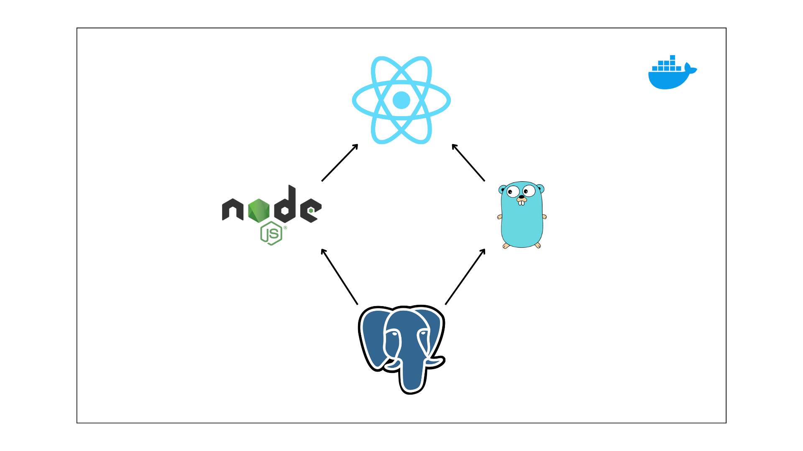
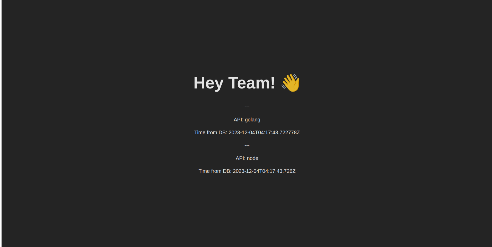

# Docker Web Application

Containerized Development Environment for Building and Deploying Web Applications (PostgreSQL, NodeJS, Golang, ReactJS)



### Introduction

This repository focuses on creating a development environment and deployment for web applications using Docker and Docker Compose. Each service encapsulates its source code, dependencies, and the Dockerfile used to containerize the components into a Docker Image. The Dockerfile has been optimized through the utilization of caching and build stages, effectively reducing the overall image size.

Folder Structure:

```
|- api-golang
    |- src
    |- Dockerfile

|- api-node
    |- src
    |- Dockerfile
    |- package*.json

|- client-react
    |- src
    |- Dockerfile

|- docker-compose.yml           # Using to run all services
```

### Getting Started

Build all the Docker images:

```bash
$ make build-all
```

or you can build each service manually:

```bash
$ make build-nodde
$ make build-golang
$ make build-react
$ make build-nginx
```

Run all the service with Docker compose:

```bash
$ docker compose up -d
```

Access to `http://localhost` to see the web client:


